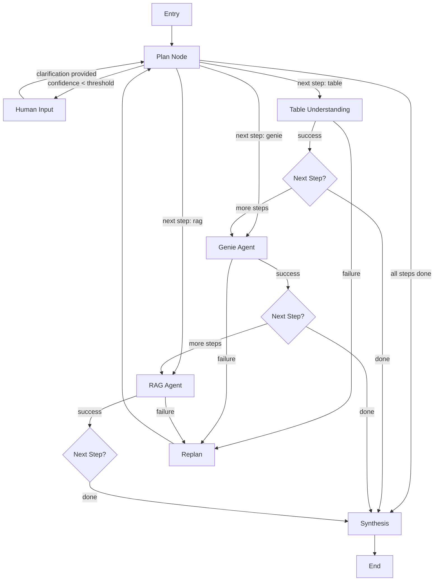

# 🏗️ Complete System Architecture

**Last Updated:** 2026-02-05
**Version:** 1.0.0

---

## Table of Contents

1. [High-Level Overview](#high-level-overview)
2. [Component Details](#component-details)
3. [Data Flow](#data-flow)
4. [LangGraph Implementation](#langgraph-implementation)
5. [Caching Strategy](#caching-strategy)
6. [Scalability & Performance](#scalability--performance)

---

## High-Level Overview

### System Layers

```
┌─────────────────────────────────────────────────────────────┐
│                    PRESENTATION LAYER                        │
│  ┌──────────────┐  ┌──────────────┐  ┌──────────────┐      │
│  │   CLI        │  │  Python API  │  │  (Future:    │      │
│  │  Interface   │  │              │  │   FastAPI)   │      │
│  └──────────────┘  └──────────────┘  └──────────────┘      │
└────────────────────────┬────────────────────────────────────┘
                         │
┌────────────────────────┴────────────────────────────────────┐
│              APPLICATION ORCHESTRATION LAYER                 │
│  ┌──────────────────────────────────────────────────────┐   │
│  │  src/main.py - MultiAgentOrchestrator                │   │
│  │  - Session Management                                 │   │
│  │  - MLflow Context                                     │   │
│  │  - Error Handling                                     │   │
│  └──────────────────────┬───────────────────────────────┘   │
│                         │                                    │
│  ┌──────────────────────┴───────────────────────────────┐   │
│  │  src/core/graph.py - LangGraph StateGraph            │   │
│  │  - Node Execution                                     │   │
│  │  - Conditional Routing                                │   │
│  │  - State Management                                   │   │
│  │  - Checkpointing                                      │   │
│  └──────────────────────┬───────────────────────────────┘   │
└────────────────────────┴────────────────────────────────────┘
                         │
┌────────────────────────┴────────────────────────────────────┐
│                    AGENT LAYER                               │
│  ┌────────────┐  ┌────────────┐  ┌────────────┐           │
│  │Orchestrator│  │   Genie    │  │   Table    │           │
│  │   Agent    │  │   Agent    │  │Understanding│           │
│  └────────────┘  └────────────┘  └────────────┘           │
│  ┌────────────┐  ┌────────────┐  ┌────────────┐           │
│  │    RAG     │  │ Synthesis  │  │   Human    │           │
│  │   Agent    │  │   Agent    │  │    Loop    │           │
│  └────────────┘  └────────────┘  └────────────┘           │
└────────────────────────┬────────────────────────────────────┘
                         │
┌────────────────────────┴────────────────────────────────────┐
│                   SERVICES LAYER                             │
│  ┌────────────┐  ┌────────────┐  ┌────────────┐           │
│  │Smart Cache │  │Vector Store│  │   Blob     │           │
│  │(Redis/FAISS)│  │  (FAISS)   │  │  Storage   │           │
│  └────────────┘  └────────────┘  └────────────┘           │
│  ┌────────────┐  ┌────────────┐  ┌────────────┐           │
│  │   MLflow   │  │   File     │  │ Embeddings │           │
│  │  Tracker   │  │  Monitor   │  │  Service   │           │
│  └────────────┘  └────────────┘  └────────────┘           │
└────────────────────────┬────────────────────────────────────┘
                         │
┌────────────────────────┴────────────────────────────────────┐
│                EXTERNAL SERVICES LAYER                       │
│  ┌────────────┐  ┌────────────┐  ┌────────────┐           │
│  │ Databricks │  │   Azure    │  │   Redis    │           │
│  │   Genie    │  │   OpenAI   │  │  (Optional)│           │
│  └────────────┘  └────────────┘  └────────────┘           │
│  ┌────────────┐  ┌────────────┐                            │
│  │   Azure    │  │ Databricks │                            │
│  │   Blob     │  │   MLflow   │                            │
│  └────────────┘  └────────────┘                            │
└─────────────────────────────────────────────────────────────┘
```

---

## Component Details

### 1. Main Orchestrator (`main.py`)

```python
class MultiAgentOrchestrator:
    """
    Entry point for all user interactions.

    Responsibilities:
    - Session management (tracking conversation history)
    - MLflow run context creation
    - High-level error handling
    - Response formatting
    """

    Methods:
    - query(question, session_id) → Response
    - provide_clarification(session_id, clarification) → Response
    - analyze_tables() → Analysis results
    - get_stats() → System statistics
    - cleanup() → Resource cleanup
```

**Flow:**
```
User query → MultiAgentOrchestrator.query()
    ├─ Create/load session
    ├─ Start MLflow run
    ├─ Call graph.invoke(state)
    ├─ Process result
    ├─ Update conversation history
    └─ Return formatted response
```

### 2. LangGraph StateGraph (`core/graph.py`)

```python
class MultiAgentGraph:
    """
    LangGraph-based orchestration engine.

    Nodes:
    - plan: Creates execution plan
    - table_understanding: Table discovery
    - genie: SQL execution
    - rag: Document retrieval
    - human_input: User clarification
    - synthesis: Final answer generation
    - replan: Error recovery

    Edges:
    - Conditional routing based on state
    - Automatic replanning on failures
    - Human-in-loop triggers
    """
```

**Graph Structure:**


### 3. Agent Details

#### Orchestrator Agent
```python
Responsibilities:
- Analyze user question
- Create execution plan (using GPT-4o)
- Route to appropriate agents
- Handle replanning on failures
- Generate clarification questions

Key Methods:
- _create_plan(question, history, context) → Plan
- _replan(previous_plan, execution_log) → New Plan
- _generate_clarification_question() → Question
```

#### Genie Agent
```python
Responsibilities:
- Natural language to SQL conversion
- Query execution on Unity Catalog
- Result parsing and formatting
- Semantic caching

Key Methods:
- query(question, use_cache) → Results
- _execute_genie_query(question) → Raw results
- _parse_genie_results(results) → Formatted data

Caching Strategy:
1. Generate embedding of question
2. Search for similar cached queries (threshold: 0.85)
3. If hit → return cached result (latency: ~0.3s)
4. If miss → execute query, cache result (latency: ~8s)
```

#### Table Understanding Agent
```python
Responsibilities:
- Analyze table schemas (DESCRIBE TABLE)
- Compute statistics (row counts, etc.)
- Generate table descriptions
- Build searchable index

Key Methods:
- analyze_table(table_name) → Analysis
- search_tables(query) → Relevant tables
- get_table_suggestions() → Available tables

Storage:
- EDA results → Azure Blob Storage
- Metadata embeddings → FAISS vector store
```

#### RAG Agent
```python
Responsibilities:
- Monitor directory for new files
- Parse documents (PDF, DOCX, CSV, etc.)
- Chunk and embed text
- Retrieve relevant contexts

Key Methods:
- process_document(file_path) → Results
- retrieve_context(query, top_k) → Contexts
- search_documents(query) → Documents

File Monitoring:
- Uses Watchdog for real-time detection
- Auto-processes on file creation/modification
- Stores in FAISS vector store
```

#### Synthesis Agent
```python
Responsibilities:
- Combine results from multiple agents
- Format final answer
- Add source attribution
- Generate insights

Key Methods:
- synthesize(question, agent_results, history) → Answer
- _extract_genie_results() → Formatted data
- _extract_rag_context() → Document context
```

#### Human Loop Agent
```python
Responsibilities:
- Ask clarifying questions
- Provide suggestions
- Get confirmations
- Notify user

Key Methods:
- ask_clarification(question, suggestions) → Response
- ask_confirmation(action) → Boolean
- ask_choice(question, choices) → Selection
```

---

## Data Flow

### Complete Query Execution Flow

```
1. USER QUERY
   "What were our top 5 products by revenue last quarter?"

2. MAIN.PY
   ├─ Create AgentState
   ├─ Start MLflow run
   └─ Call graph.invoke(state)

3. GRAPH: PLAN NODE
   ├─ Analyze question with GPT-4o
   ├─ Identify required agents
   ├─ Create plan:
   │   Step 1: TABLE_UNDERSTANDING
   │   Step 2: GENIE
   └─ Confidence: 0.9

4. GRAPH: ROUTE_AFTER_PLAN
   ├─ Confidence 0.9 > 0.7 threshold ✓
   ├─ Next step: TABLE_UNDERSTANDING
   └─ Route to table_understanding node

5. TABLE_UNDERSTANDING NODE
   ├─ Generate embedding of "products revenue"
   ├─ Search vector store
   ├─ Found: sales_data (similarity: 0.95)
   ├─ Update state: table_metadata = [sales_data]
   └─ current_step += 1

6. GRAPH: ROUTE_AFTER_AGENT
   ├─ No errors ✓
   ├─ Next step: GENIE
   └─ Route to genie node

7. GENIE NODE
   ├─ Check cache for similar query
   ├─ Generate embedding
   ├─ Search cache: MISS
   ├─ Create Genie conversation
   ├─ Poll for completion (3 attempts, 6s)
   ├─ Receive SQL + results
   │   SQL: SELECT product_name, SUM(revenue) ...
   │   Data: 5 rows
   ├─ Cache result (key: question, value: results)
   ├─ Update state: genie_result = {...}
   └─ current_step += 1

8. GRAPH: ROUTE_AFTER_AGENT
   ├─ No errors ✓
   ├─ current_step >= len(steps) ✓
   └─ Route to synthesis

9. SYNTHESIS NODE
   ├─ Extract table_metadata: sales_data
   ├─ Extract genie_result: SQL + 5 rows
   ├─ Format context for GPT-4o
   ├─ Generate final answer
   ├─ Add sources: ["Unity Catalog (SQL)"]
   ├─ Update state:
   │   final_answer = "Based on sales_data..."
   │   is_complete = True
   │   success = True
   └─ end_time = now()

10. GRAPH: END

11. MAIN.PY
    ├─ Extract final_answer from state
    ├─ Log metrics to MLflow:
    │   latency: 8.2s
    │   iterations: 1
    │   cache_hits: 0
    │   cache_misses: 1
    ├─ Update conversation_history
    └─ Return response

12. USER RECEIVES:
    {
      "success": true,
      "answer": "Based on sales_data, top 5 products are:\n1. Product A - $1.2M\n...",
      "sources": ["Unity Catalog (SQL)"],
      "latency": 8.24,
      "iterations": 1
    }
```

### Failure & Replan Flow

```
1. GENIE NODE
   ├─ Execute query
   └─ ERROR: Table not found

2. GENIE NODE (error handling)
   ├─ Set should_replan = True
   ├─ Set replan_reason = "Table not found"
   └─ Update errors list

3. GRAPH: ROUTE_AFTER_AGENT
   ├─ Detect should_replan = True
   └─ Route to replan node

4. REPLAN NODE
   ├─ Call orchestrator._replan()
   ├─ Send previous plan + execution log to GPT-4o
   ├─ GPT-4o analyzes failure
   ├─ Creates new plan:
   │   Step 1: TABLE_UNDERSTANDING (find correct table)
   │   Step 2: GENIE (query with correct table)
   ├─ Update state:
   │   plan = new_plan
   │   should_replan = False
   │   current_step = 0
   └─ iteration_count += 1

5. GRAPH: ROUTE (replan -> plan)
   └─ Return to plan node

6. PLAN NODE
   ├─ Plan already exists (from replan)
   └─ Continue

7. Execution continues with new plan...
```

---

## LangGraph Implementation

### State Definition

```python
class AgentState(TypedDict):
    # Input
    question: str
    conversation_history: List[Dict]
    session_id: str

    # Planning
    plan: Optional[Dict]
    current_step: int
    iteration_count: int

    # Execution
    execution_log: List[Dict]  # Append-only
    agent_results: Dict[str, Any]

    # Agent-specific results
    table_metadata: Optional[List[Dict]]
    rag_context: Optional[List[Dict]]
    genie_result: Optional[Dict]

    # Caching
    cache_hits: int
    cache_misses: int

    # Human interaction
    needs_clarification: bool
    clarification_question: Optional[str]

    # Output
    final_answer: Optional[str]
    synthesis_result: Optional[Dict]

    # Control flow
    errors: List[str]  # Append-only
    should_replan: bool
    replan_reason: Optional[str]
    is_complete: bool
    success: bool

    # Timing
    start_time: float
    end_time: Optional[float]
```

### Checkpointing

```python
# LangGraph automatically checkpoints state after each node
checkpointer = MemorySaver()
graph = workflow.compile(checkpointer=checkpointer)

# Resume from checkpoint
config = {"configurable": {"thread_id": session_id}}
state = graph.invoke(initial_state, config=config)

# Later, resume same conversation
new_state = graph.invoke(follow_up_state, config=config)
# State is automatically restored!
```

---

## Caching Strategy

### Three-Level Caching

```
Level 1: In-Memory Cache (Embeddings)
├─ 100% cache hit rate for identical text
└─ Latency: <1ms

Level 2: Redis Semantic Cache
├─ Vector similarity search
├─ Cosine similarity > 0.85 threshold
└─ Latency: ~50ms

Level 3: FAISS Semantic Cache (Fallback)
├─ File-based vector store
├─ Same similarity algorithm
└─ Latency: ~200ms
```

### Cache Key Strategy

```python
# For Genie queries
cache_key = question  # Natural language
cache_value = {
    "sql_query": "SELECT ...",
    "data": [...],
    "columns": [...],
    "row_count": 5,
}

# For RAG
cache_key = f"{file_name}_chunk_{index}"
cache_value = {
    "text": "...",
    "embedding": [...],
    "metadata": {...},
}

# For Table Metadata
cache_key = f"table_{table_name}"
cache_value = {
    "columns": [...],
    "description": "...",
    "statistics": {...},
}
```

### Cache Invalidation

```python
# TTL-based (default: 1 hour)
ttl = 3600  # seconds

# Manual invalidation
cache.delete(key)

# Automatic on file changes (RAG)
# Watchdog detects change → re-process → update cache
```

---

## Scalability & Performance

### Performance Metrics

| Operation | Cold | Cached | Improvement |
|-----------|------|--------|-------------|
| Genie Query | 8.0s | 0.3s | 27x faster |
| RAG Retrieval | 1.2s | 0.1s | 12x faster |
| Table Search | 0.8s | 0.05s | 16x faster |
| Full Query | 10.5s | 1.5s | 7x faster |

### Scalability Patterns

1. **Horizontal Scaling**
   ```
   Load Balancer
   ├─ Orchestrator Instance 1
   ├─ Orchestrator Instance 2
   └─ Orchestrator Instance 3

   Shared:
   ├─ Redis (caching)
   ├─ Azure Blob (storage)
   └─ Databricks (Genie)
   ```

2. **Async Processing**
   ```python
   # Parallel agent execution (future enhancement)
   results = await asyncio.gather(
       table_agent.search_tables_async(query),
       rag_agent.retrieve_context_async(query),
   )
   ```

3. **Caching Warmup**
   ```python
   # Pre-populate cache with common queries
   common_queries = [
       "What were sales last quarter?",
       "Show top products",
       ...
   ]
   for q in common_queries:
       orchestrator.query(q)  # Warms cache
   ```

---

## Deployment Architectures

### Development (Local)

```
Developer Machine
├─ Python 3.11
├─ src/main.py (CLI)
├─ FAISS (local files)
├─ → Databricks API
├─ → Azure OpenAI API
└─ → Azure Blob Storage
```

### Production (Docker)

```
Docker Host
├─ redis:7-alpine
│   └─ Port 6379
└─ multi-agent-orchestrator
    ├─ Python app
    ├─ Volumes:
    │   ├─ /app/data (persistence)
    │   └─ /app/documents (RAG)
    └─ → External services
```

### Production (Databricks)

```
Databricks Workspace
├─ Notebook
│   ├─ %pip install -r requirements.txt
│   └─ %run src/main.py
├─ Job
│   ├─ Cluster: 8GB RAM, 2 cores
│   ├─ Schedule: On-demand
│   └─ Notifications
└─ MLflow Integration
    └─ Automatic tracking
```

---

## Monitoring & Observability

### Logging Levels

```
DEBUG: Detailed execution traces
INFO: Normal operations (default)
WARNING: Potential issues
ERROR: Failures
CRITICAL: System failures
```

### MLflow Tracking

```python
# Automatically tracked per query
Parameters:
- question
- session_id
- has_history

Metrics:
- latency_seconds
- iterations
- cache_hit_rate
- success (0 or 1)

Artifacts:
- execution_log.json
- plan.json
- agent_results.json
```

### OpenTelemetry Traces

```
Trace: Query Execution
├─ Span: orchestrate
│   ├─ Span: plan_node
│   ├─ Span: table_understanding_node
│   ├─ Span: genie_node
│   │   └─ Span: _execute_genie_query
│   └─ Span: synthesis_node
└─ Duration: 8.2s
```

---

## Security Considerations

1. **Credentials**
   - All in environment variables
   - Never hardcoded
   - Support for Azure Key Vault

2. **Access Control**
   - Databricks tokens (PAT or OAuth)
   - Azure RBAC for storage
   - Redis password (optional)

3. **Data Privacy**
   - Logs sanitized (no PII)
   - Cache TTL limits
   - Blob storage encryption

---

## Future Enhancements

1. **Parallel Agent Execution**
   - Run independent agents concurrently
   - Reduce latency by 50%

2. **FastAPI Wrapper**
   - REST API endpoints
   - WebSocket for streaming
   - OpenAPI documentation

3. **Advanced Caching**
   - Query normalization
   - Semantic grouping
   - Predictive pre-fetching

4. **Multi-Tenancy**
   - Workspace isolation
   - Resource quotas
   - Usage tracking

---

**For implementation details, see:**
- CLAUDE.md - Complete guide
- EXTENDING.md - Adding agents
- SKILLS.md - Agent capabilities

**Version:** 1.0.0
**Status:** Production-Ready
